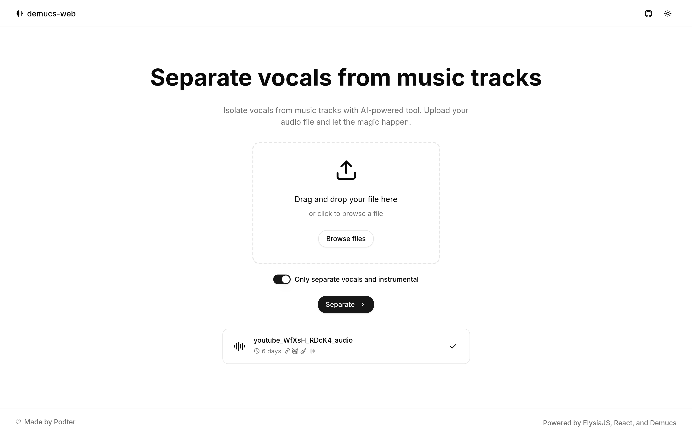

# demucs-web

A web interface for [Demucs](https://github.com/adefossez/demucs), a state-of-the-art music source separation model.
Separate vocals, drums, bass and others from any track.



## Deployment

First, you need to deploy the Demucs server inside `demucs` folder somewhere.
This server will be responsible for separating the audio tracks, so it needs GPU support.

I deployed this on [Lightning AI](https://lightning.ai).

These are environment variables for the Demucs server:

- `API_URL`: URL of the web interface server
- `MODEL`: Model to use for separation. `htdemucs_ft` is recommended. Read more about the models [here](https://github.com/adefossez/demucs/?tab=readme-ov-file#separating-tracks).

Then you can deploy the web interface server:

```bash
docker compose up -d --build
```

These are environment variables for the web interface server:

- `SECRET`: Secret key for the server, used for authentication
- `DEMUCS_API`: URL of the Demucs server
- `DEMUCS_API_KEY`: API key for the Demucs server (optional, if deployed on Lightning AI)

## Development

Make sure you have Bun installed, then run:

```bash
bun dev
```

Check `http://localhost:3000` to see the result.

## License

This project is licensed under the MIT license. See the [LICENSE](LICENSE) file for more information.
